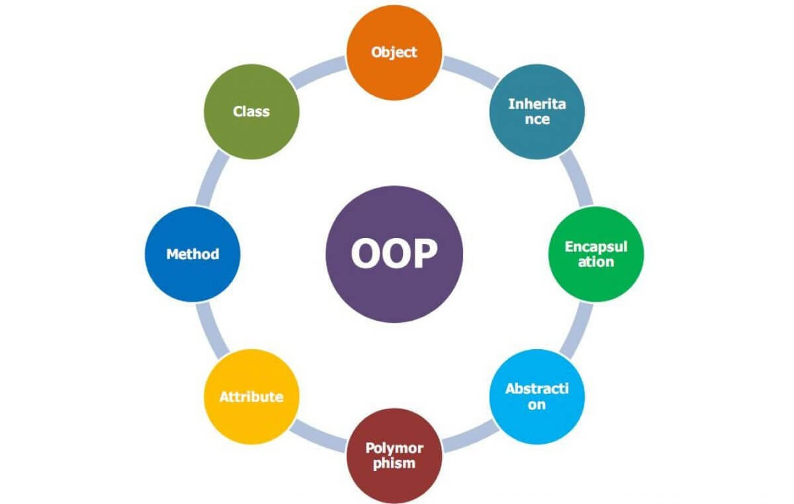

# OBJECT ORIENTED PROGRAMMING (OOPs)

<div>

</div>

## 🧱 The 4 Pillars of OOP in JavaScript
<h3>

- Encapsulation
- Abstraction
- Inheritance
- Polymorphism (Overriding)
</h3>

## Additional Concepts

<h3>

- Class & how instance should created
- Constructor
- this
- Private Method/Private variable
- Public Method/Public variable
- Protected Method/Protected variable
- Super() constructor
- Getter()
- Setter()
- Static variable 

</h3>


## Encapsulation

<p>Definiton:</p>

 - Data + methods bundled together
 - Control access using:
   - private fields (#)
   - getters/setters

```code
<!-- base class -->
class BankAccount {
    
    #balance; // Private field

    constructor(initialBalance) {
        this.#balance = initialBalance;
    }

    // Public method to deposit funds
    deposit(amount) {
        if (amount > 0) {
            this.#balance += amount;
            console.log(`Deposited: ${amount}. New Balance: ${this.#balance}`);
        } else {
            console.log("Invalid deposit amount.");
        }
    }

    // Public method (getter) to view balance (READ OPERATION)
    getBalance() {
        return this.#balance;
    }

    // Setter Fn to valid the balance of the Account 
    set balance (newBalance){
        if (this.#balance < 50) {
          console.log("❌ Cannot update. Insufficient balance (< 50).");
          return;
        }
         this.#balance = newBalance;
         console.log(`✔ Balance updated to: ${this.#balance}`);
    }

}

<!-- Usage -->
const myAccount = new BankAccount(25);

myAccount.deposit(20); // Output: Deposited: 50. New Balance: 150

console.log(myAccount.getBalance()); // Output: 150

myAccount.balance = 200;

myAccount.deposit(20);

myAccount.balance = 200;
```

---

## Abstraction

<p> Definition: </p> 

- Abstraction is the concept of hiding the complex implementation details and
-  showing only the essential features or functionality to the user. 

```code

<!--  Base Class -->

class BankAccount {
  #balance; // Private field

  constructor(initialBalance) {
    this.#balance = initialBalance;
    
  }

  // Public method to deposit funds
  deposit(amount) {
    if (amount > 0) {
      this.#balance += amount;

      console.log(`Deposited: ${amount}. New Balance: ${this.#balance}`);

   

    } else {
      console.log("Invalid deposit amount.");
    }
  }

  // Public method (getter) to view balance (READ OPERATION)
  getBalance() {
    return this.#balance;
  }

  // Setter Fn to valid the balance of the Account
  set balance(newBalance) {
    if (this.#balance < 50) {
      console.log("❌ Cannot update. Insufficient balance (< 50).");
      return;
    }
    this.#balance = newBalance;
    console.log(`✔ Balance updated to: ${this.#balance}`);
  }

  // Abstraction: user only sees this method, not the internal email logi
  sendEmail(name) {
    console.log(`Sending email to ${name}...`);
    // Hidden complexity: imagine SMTP or API integration here
    console.log(
      `Email content: balance:${ this.#balance} ,UserName: ${name}`
    );
  }
}

<!-- Usage -->
const myAccount = new BankAccount(25);

myAccount.deposit(20); // Output: Deposited: 50. New Balance: 45

console.log(myAccount.getBalance()); // Output: 150

myAccount.sendEmail("RamAlagar")

```

<p style="font-weight:bold;">

- sendEmail() hides the complexity of how emails are sent.

- The user just calls the method without worrying about SMTP or API details.

</p>

---

## Inheritance &  Polymorphism

<p>Inheritance Definition:</p>

- Inheritance is a mechanism 
- that allows a new class (child class or derived class) to inherit properties and methods from an existing class (parent class or base class).

<p> Polymorphism Definition: </p>

- Polymorphism (meaning "many forms") is the ability of an object or method to take on many forms or to behave differently 
- depending on the context in which it is used.


``` code

<!--  Base Class -->
class Complaint {
  #complaintId;

  constructor(id, user, description) {
    this.#complaintId = id;
    this.user = user;
    this.description = description;
    this._status = "Pending";
  }

  generateReport() {
    return `Complaint Report: ID=${this.#complaintId}, User=${
      this.user
    }, Status=${this._status}`;
  }
}

```

``` code
// Sub Class -> Inheritanced Class

// DistrictComplaint extends Complaint
class DistrictComplaint extends Complaint {
  constructor(id, user, description, district) {
    super(id, user, description); // reuse base constructor
    this.district = district;
  }

  // Override (Polymorphism)
  generateReport() {
    return `District Complaint Report: District=${this.district}, User=${this.user}, Status=${this._status}`;
  }
}

// -------------------------------------------------

// StateComplaint extends Complaint
class StateComplaint extends Complaint {
  constructor(id, user, description, state) {
    super(id, user, description);
    this.state = state;
  }

  // Override (Polymorphism)
  generateReport() {
    return `State Complaint Report: State=${this.state}, Complaint by ${this.user}, Status=${this._status}`;
  }
}
```

```code 
<!-- Usage -->

<!-- Base class usage -->

const complaint1 = new Complaint(101, "Karthick", "Streetlight not working");

console.log(complaint1.generateReport()); 

<!-- Complaint Report: ID=101, User=Karthick, Status=Pending -->

<!-- District subclass usage -->

const districtComplaint = new DistrictComplaint(
  102,
  "Priya",
  "Water leakage",
  "Chennai"
);

console.log(districtComplaint.generateReport());

 <!--  District Complaint Report: District=Chennai, User=Priya, Status=Pending -->

<!--  State subclass usage -->

const stateComplaint = new StateComplaint(
  103,
  "Arun",
  "Road damage",
  "Tamil Nadu"
);

console.log(stateComplaint.generateReport());

 <!--  State Complaint Report: State=Tamil Nadu, Complaint by Arun, Status=Pending -->

```

---

